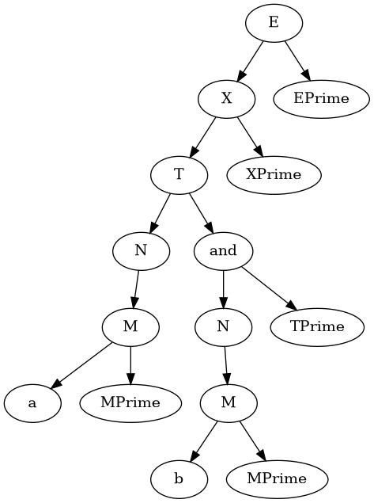

# Translator Generator

`trgpp` is simple, but feature prof and modern  automatic lexer parser and
parser generation for easy creation of translators for LL(1) grammars using recursive descent.

## Features

+ Automatic generation of FIRST and FOLLOW sets for input grammar
+ Attributed Translation Symbols support
+ Inherited Attributes generation
+ Synthesized Attributes generation
+ Custom [location API](./user/include/Location.h) for showing errors in input files of generated parser

## Your own translator using `trgpp

To create your own translator you need to define:

1. Lexer configuration file. It have syntax, very similar to `Flex`'s one. example:

    ```lex
    %header {
    // arbitrary C++ code, for example headers include, or definition 
    // of your `Lexer` class
    }

    %rules {
      // rules:          `"PATTERN" { ACTION }`
      // or using regex: `/REGEX/ { ACTION }`
    }
    ```

    `trgpp-lg` lexer generator will generate header with implementation of `virtual TokenType nextToken()` function defined in [`LexerBase`](./user/include/LexerBase.h) according to your config (be sure to define inherited class itself).

2. Parser configuration file. It has syntax very similar to `GNU Bison`'s, but with
  inherited attributes support:

  ```bison
  %header {
  // Any C++ code
  }

  %tokens {
    // Tokens definition:                                  `NAME: TYPE;`
    // Or just type, if your token do not have attributes: `NAME;`
  }

  %grammar {
    // Place your grammar definition here!
    // Format: `NONTERMINAL_NAME(ARGUMENTS): RETURN_TYPE -> SYMBOLS | ... ;
  }
  ```

Following implemented examples are very useful when creating your own translator, using `trgpp`:

+ [Simple calculator](./examples/calculator/) using translation symbols to calculate expressions
+ [Logical expressions](./examples/calculator/) parser with visualization

## Building&Test All Project

```bash
cmake -B .build
cmake --build .build --target all
cmake --build .build --target test

# Run calculator example
.build/examples/calculator/calculator "12.7 % 5 * (11 - 1.1) + 5"

# Run AST visualization
.build/examples/logical-expressions/logical-expressions "a and b" a.png
.build/examples/logical-expressions/logical-expressions "a and b or (d not     in s)   " a.png
```

Check out visualization of `a and b` expression:
